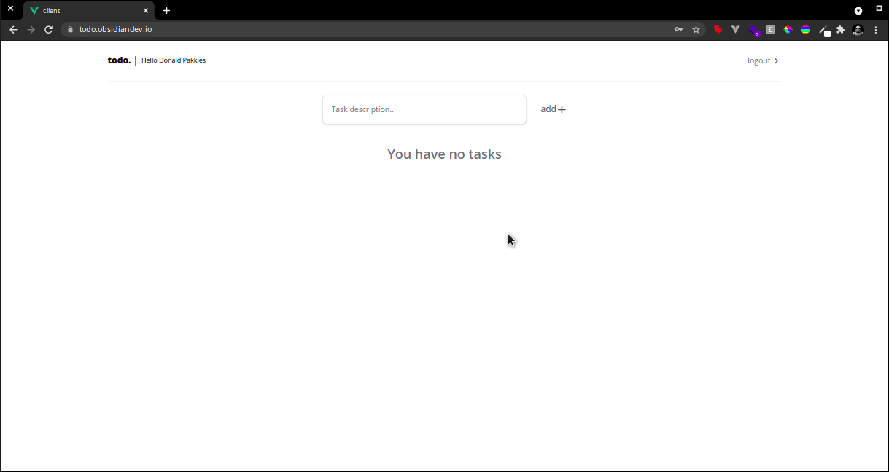

# Formidablejs Example Application

This is an example application that uses Formidablejs and Vuejs.

## Getting Started

Clone the repo:

```bash
git clone https://github.com/donaldp/formidablejs-example
```

### Setting up the API

Steps to set up the API:

```bash
cd formidablejs-example/api
npm i
cp .env.example .env
craftsman key
craftsman cache
```

Running the API:

```bash
craftsman serve --dev
```

> API will be available at: http://localhost:3000

#### Setting up the frontend/client

Steps to set up the frontend/client:

```bash
cd formidablejs-example/client
npm i
cp .env.example .env
```

Running the frontend/client:

```bash
npm run serve
```

> Frontend will be available at: http://localhost:8080

### Environment Variables

#### API

If the API is running on a different port, you can change the `VUE_APP_API_URL` value in the `formidablejs-example/client/.env`` file an.

You will also be required to change the `APP_URL` value in the `formidablejs-example/api/.env` file.

#### Frontend/Client

If the frontend/client is running on a different port, you can change the `CLIENT_URL` value in the `formidablejs-example/api/.env` file.

#### Credentials

```
email: test@example.com
pass: password
```

## Demo

You can have peek at the demo at: https://todo.obsidiandev.io

> Note: credentials above don't work on the demo site.



## License

The MIT License (MIT). Please see [License File](LICENSE) for more information.
